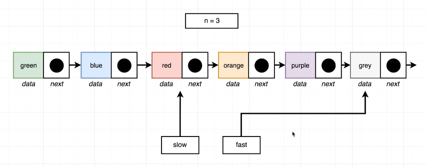
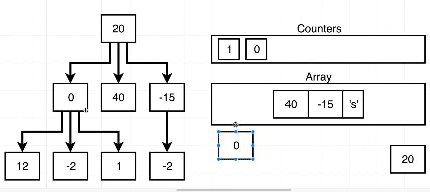

# Algorithms and DataStructures
 Algorithms and Data Structures

## Fibonacci Series
- 

## Write a function to reverse a string
```c#
string ReverseString(string s)
{
    char[] charArray = s.ToCharArray();
    StringBuilder sb = new StringBuilder();
    for (int i = 0; i < charArray.Length; i++)
    {
        sb.Append(charArray[charArray.Length - i - 1]);
    }
    return sb.ToString();
}

```

- In javascript it can done as follows:

```js
// --- Directions
// Given a string, return a new string with the reversed
// order of characters
// --- Examples
//   reverse('apple') === 'leppa'
//   reverse('hello') === 'olleh'
//   reverse('Greetings!') === '!sgniteerG'

function reverse(str) {
    const reverseArr = str.split('');
    let reversedString = '';
    for (let i = 0; i < reverseArr.length; i++) {
        reversedString += reverseArr[reverseArr.length - 1 - i];
    }
    return reversedString;
}

module.exports = reverse;

```

-  Reverse() function is built into Javascript and C#
-  In javascript we have Array.prototype.reverse().
-  Another technique we can do in javascript is as follows:
```js 
 function reverse(str) {
    let reversedString = "";
    for(let character of str){
        //This wont work if we do reversedString += character coz that is reversedString = reversedString + character
        //initially reversed string is empty, so when we loop over it, then we add each element before the first element
        reversedString  =  character + reversedString;
    }
    return reversedString;
}

```
- Another option in javascript is to do this using the reduce function 
```js 
 function reverse(str) {
    return str.split('').reduce((reversed,character) => {
        reversed = character + reversed;
        return reversed;
    },'');
}

```


- Another technique in C# is as follows which uses while loop and we swap the first and last elements of a string:
```c#
 string ReverseStringWhileLoop(string s)
{
    char[] charArray = s.ToCharArray();
    int start = 0;
    int end = charArray.Length - 1;

    while (start < end)
    {
        //Put it in a temporary variable
        char temp = charArray[start];
        //swap the start and the last elements
        charArray[start] = charArray[end];
        charArray[end] = temp;
        

        //move to the next element from front
        start++;
        //move to the next element from the back
        end--;
    }

    return new string(charArray);
}


```

- We can run a js file with the following commands
```shell
node inspect index.js
# We can hit the debugger then 
# Then we can write 
repl 
# We enter the repl mode and we can inspect variables.
```
- 

## Check if a string is palindrome or not 
```js 
 // --- Directions
// Given a string, return true if the string is a palindrome
// or false if it is not.  Palindromes are strings that
// form the same word if it is reversed. *Do* include spaces
// and punctuation in determining if the string is a palindrome.
// --- Examples:
//   palindrome("abba") === true
//   palindrome("abcdefg") === false

function palindrome(str) {
    const reversedString = str.split('').reduce((reversedString, character) => {
        return character + reversedString;
    },'');
    return str === reversedString
}


module.exports = palindrome;


```

- We can do it using every() helper in ES6 Javascript also 
- 
- 
```js
 function palindrome(str) {
    return str.split('').every((char,index) => {
        return char === str[str.length-index-1];
    })
}

```


### Using C# we can do it as follows:
```c#
 bool CheckIfPalindromeOrNot(string s)
{
    char[] chars = s.ToCharArray();
    int start = 0;
    int end = chars.Length - 1;
    while (start < end)
    {
        if (chars[start] != chars[end])
        {
            return false;
        }

        start++;
        end--;
    }
    return true;
}

```


## Reverse an integer 
- We can do it in c# as follows:
```c#
 int ReverseInt(int num)
{
    int reversed = 0;
    while (num != 0)
    {
        int digit = num % 10;
        reversed = reversed * 10 + digit;
        num = num / 10;
    }
    return reversed;
}

```

- In javascript we have a function 
- 
- We can do it in javascript as follows: 
```js 
 function reverseInt(num) {
    let isNegative = num < 0;
    num = Math.abs(num);

    let reversed = 0;

    while (num !== 0) {
        let digit = num % 10;
        reversed = reversed * 10 + digit;
        num = Math.floor(num / 10);
    }

    if(isNegative) {
        reversed = -reversed;
    }

    return reversed;
}

```
- An alternative could be done using Math.sign:
```js 
 function reverseIntAlternative(n)
{
    const reversed = n.toString().split('').reverse().join('');
    //Math.sign return 1 if n > 0, if n < 0 then it returns -1
    return reversed * Math.sign(n);
}


```

## Find the Maxchar in a string 
- 
- 

- In c# we can do it as follows: 
```c#
 char MaxChar(string s)
{
    char[] chars = s.ToCharArray();
    int start = 0;
    Dictionary<char,int> dict = new Dictionary<char,int>();
    while (start < chars.Length)
    {
        if(!dict.ContainsKey(chars[start]))
        {
            dict[chars[start]] = 1;
        }
        else
        {
            dict[chars[start]]++;
        }

        start++;
    }

    // Find the character with the maximum frequency
    char maxChar = '\0';
    int maxCount = 0;

    foreach (var pair in dict)
    {
        if (pair.Value > maxCount)
        {
            maxCount = pair.Value;
            maxChar = pair.Key;
        }
    }

    return maxChar;
}


```
- We can do it in javascript as follows: 
```js 
 function maxChar(str) {
    const charMap = new Map();

    // Count the frequency of each character in the string
    for (let char of str) {
        if (charMap.has(char)) {
            charMap.set(char, charMap.get(char) + 1);
        } else {
            charMap.set(char, 1);
        }
    }

    // Find the character with the maximum frequency
    let maxChar = '';
    let maxCount = 0;

    for (let [char, count] of charMap) {
        if (count > maxCount) {
            maxCount = count;
            maxChar = char;
        }
    }

    return maxChar;
}


```
- Alternative way in javascript
- 
- This is done using Character Map: 
```js
 function maxChar(str){
    const chars = {};

    //used to iterate through an array or string
    for(let character of str){
        //chars[character] = chars[character] + 1 || 1;
        if(!chars[character]){
            chars[character] = 1
        } else {
            chars[character]++;
        }
    }

    let maxCount = 0;
    let maxKey = '';

    //used to iterate through an object
    for(let key in chars)
    {
        if(chars[key] > maxCount){
            maxCount = chars[key];
            maxKey = key;
        }
    }

    return maxKey;
}


```

## Classic FizzBuzz
In C# we can do it like this 
```c#
 void fizzbuzz(int n)
{
    int i = 1;

    while (i <= n)
    {
        if (i % 3 == 0)
        {
            if (i % 5 == 0)
            {
                Console.WriteLine("fizzbuzz");
            }
            else
            {
                Console.WriteLine("fizz");
            }
        }
        else
        {
            if (i % 5 == 0)
            {
                Console.WriteLine("buzz");
            }
            else
            {
                Console.WriteLine(i);
            }
        }

        i++;
    }
}

```
- In javascript we can do it like this 
```js 
 function fizzBuzz(n) {
let i = 1;
while (i <= n) {
    if(i % 3 === 0) {
        if(i % 5 === 0) {
            console.log("fizzbuzz");
        }
        else {
            console.log("fizz");
        }
    } else {
        if(i % 5 === 0) {
            console.log("buzz");
        } else{
            console.log(i);
        }
    }
    i++;
}
}


```

## Array Chunking
- Problem Statement
```js
// --- Directions
// Given an array and chunk size, divide the array into many subarrays
// where each subarray is of length size
// --- Examples
// chunk([1, 2, 3, 4], 2) --> [[ 1, 2], [3, 4]]
// chunk([1, 2, 3, 4, 5], 2) --> [[ 1, 2], [3, 4], [5]]
// chunk([1, 2, 3, 4, 5, 6, 7, 8], 3) --> [[ 1, 2, 3], [4, 5, 6], [7, 8]]
// chunk([1, 2, 3, 4, 5], 4) --> [[ 1, 2, 3, 4], [5]]
// chunk([1, 2, 3, 4, 5], 10) --> [[ 1, 2, 3, 4, 5]]

```
- We can do it in C# as follows: 
```c#
void Chunk(int[] inputArray, int length)
{
    int arrayLength = inputArray.Length;
    int chunkSize  = arrayLength / length;
    List<int[]> chunks = new List<int[]>();
    for (int i = 0; i < inputArray.Length; i += chunkSize)
    {
        int[] chunk = inputArray.Skip(i).Take(chunkSize).ToArray();
        chunks.Add(chunk);
    }
    // Print the chunks as an array with subarrays
    Console.Write("[");
    for (int i = 0; i < chunks.Count; i++)
    {
        Console.Write("[{0}]", string.Join(", ", chunks[i]));
        if (i < chunks.Count - 1)
        {
            Console.Write(", ");
        }
    }
    Console.WriteLine("]");
}

```
 - In javascript we can do so using slice function of arrays: 
 - 
```js
 function chunk(array, size) {
let chunks = [];
for (let i = 0; i < array.length; i+=size) {
    let chunk = array.slice(i, i + size);
    chunks.push(chunk);
}
return chunks;
} 


```
- We can do the above using while loop also
- 

- If we dont want to use slice, we can use this algorithm also.
- 
```js
 function chunk(array,size) {
    let chunked = [];

        for(let elem of array) {
            const last = chunked[chunked.length - 1];
            if(!last || last.length === size) {
                chunked.push([elem]);
            } else {
                last.push(elem);
            }
        }
        return chunked;
}

```
- Another alternative in JS is as follows:
```js 
 function chunk(array,size) {
    let chunked = [];

        let chunk = [];
        for(let elem of array) {
            if(chunk.length < size) {
                chunk.push(elem);
            }
            else {
                chunked.push(chunk);
                chunk = [];
                chunk.push(elem);
            }
        }
        if(chunk.length > 0){
            chunked.push(chunk);
        }
    return chunked;
}


```

## Anagrams
- Problem Statement 
```js
 // --- Directions
// Check to see if two provided strings are anagrams of eachother.
// One string is an anagram of another if it uses the same characters
// in the same quantity. Only consider characters, not spaces
// or punctuation.  Consider capital letters to be the same as lower case
// --- Examples
//   anagrams('rail safety', 'fairy tales') --> True
//   anagrams('RAIL! SAFETY!', 'fairy tales') --> True
//   anagrams('Hi there', 'Bye there') --> False

```
- Solution in c#
```c#
bool isAnagram(string strA, string strB)
{
    strA = string.Join("", strA.Split(default(string[]), StringSplitOptions.RemoveEmptyEntries));
    strB = string.Join("", strB.Split(default(string[]), StringSplitOptions.RemoveEmptyEntries));

    if(strA.Length != strB.Length)
    {
        return false;
    }

    char[] chars = strA.ToLower().ToCharArray();
    bool result = true;
    Dictionary<char, int> dict = new Dictionary<char, int>();
    foreach(var character in chars)
    {
        if (!char.IsWhiteSpace(character))
        {
            if (dict.ContainsKey(character))
            {
                dict[character]++;
            }
            else
            {
                dict[character] = 1;
            }
        }
      
    }

    char[] charsB = strB.ToLower().ToCharArray();
    Dictionary<char, int> dictB = new Dictionary<char, int>();
    foreach (var character in charsB)
    {
        if (!char.IsWhiteSpace(character))
        {

            if (dictB.ContainsKey(character))
            {
                dictB[character]++;
            }
            else
            {
                dictB[character] = 1;
            }
        }
    }

    foreach(var item in dictB)
    {
        if (dict.ContainsKey(item.Key))
        {
            if (dict[item.Key] != dictB[item.Key])
            {
                return false;
            }
        }
    }

    return result;

}
```
- In javascript we can do it as follows:
```js
function anagrams(stringA, stringB) {
    // Remove any non-alphabetic characters and convert to lowercase
    stringA = stringA.replace(/[^\w]/g, '').toLowerCase();
    stringB = stringB.replace(/[^\w]/g, '').toLowerCase();

    // If the lengths are not the same, they cannot be anagrams
    if (stringA.length !== stringB.length) {
        return false;
    }

    // Sort the characters of both strings and compare
    let sortedStr1 = stringA.split('').sort().join('');
    let sortedStr2 = stringB.split('').sort().join('');

    return sortedStr1 === sortedStr2;
}

```
- We can also use the charMap method in javascript(similar to dictionary in javascript)
```js
function anagrams(stringA, stringB){
    const aCharMap = buildCharMap(stringA);
    const bCharMap = buildCharMap(stringB);

    if(Object.keys(aCharMap).length !== Object.keys(bCharMap).length ){
        return false;
    }

    for(let char in aCharMap){
        if(aCharMap[char] !== bCharMap[char]){
            return false;
        }
    }

    return true;
}

function buildCharMap(str){
    const charMap = {};
    for(let char of str.replace(/[^\w]/g,'').toLowerCase()){
        if(!charMap[char]){
            charMap[char] = 1;
        } else {
            charMap[char]++;
        }
    }
    return charMap;
}

```

## Sentence Capitalization
- Problem Statement 
```js
// --- Directions
// Write a function that accepts a string.  The function should
// capitalize the first letter of each word in the string then
// return the capitalized string.
// --- Examples
//   capitalize('a short sentence') --> 'A Short Sentence'
//   capitalize('a lazy fox') --> 'A Lazy Fox'
//   capitalize('look, it is working!') --> 'Look, It Is Working!'

```
- Solution in c#
- 
```c#
 string CapitalizeString(string str)
{
    string[] strings = str.Split(new char[] { ' ' }, StringSplitOptions.None);
    

    for(int i = 0; i < strings.Length; i++) 
    {
        char[] chars = strings[i].ToCharArray();
        chars[0] = char.ToUpper(chars[0]);
        strings[i] = new string(chars);
    }

    return string.Join(" ", strings);
}

```
- Same logic in Javascript can be done as follows:
```js
 function capitalize(str) {
    const strings = str.split(' ');
    for (let i = 0; i < strings.length; i++) {
        let currentString = strings[i];
        currentString = currentString.charAt(0).toUpperCase() + currentString.slice(1);
        strings[i] = currentString;
    }
    return strings.join(' ');
}

```
- Alternative Solution
- 
```js
 function capitalize(str) {
    let result = str[0].toUpperCase();
    for(let i = 1; i < str.length; i++) {
        if(str[i - 1] === ' ') {
            result += str[i].toUpperCase();
        }
        else {
            result += str[i];
        }
    }
    return result;
}

```

## Printing Steps
- Problem Statement 
```js
 // --- Directions
// Write a function that accepts a positive number N.
// The function should console log a step shape
// with N levels using the # character.  Make sure the
// step has spaces on the right hand side!
// --- Examples
//   steps(2)
//       '# '
//       '##'
//   steps(3)
//       '#  '
//       '## '
//       '###'
//   steps(4)
//       '#   '
//       '##  '
//       '### '
//       '####'


```
- Solution in C#
```c#
void PrintSteps(int n)
{
    int i = 1;
    while(i <= n)
    {
        StringBuilder sb = new StringBuilder();
        for(int j = 0; j < i; j++)
        {
            sb.Append("#");
        }
        Console.WriteLine(sb.ToString());

        i++;
    }
}


```
- Solution in javascript 
- 
```js
 function steps(n) {
    for(let row = 0; row < n; row++){
        let stair = '';
        for(let col = 0; col < n; col++){
            if(col <= row){
                stair += '#';
            } else {
                stair += ' ';
            }
        }
        console.log(stair);
    }
}


```
- Solution that i worked on 
```js
function steps(n) {
    let i = 1;
    while( i<=n) {
        let str = '';
        for(let j = 0; j<i; j++){
            str+='#';
        }
        let diff = n - str.length;
        for(let k = 0; k < diff; k++){
            str += ' ';
        }
        console.log(str);
        i++;
    }
}


```
- Solution using Recursion 
- In recursion we need to think of a base case always 
```js 
 //Function to print numbers from 1 to 10
function printNumber(n) {
    //base case
    if(n === 0) {
        return;
    }
    
    console.log(n);
    //Change the arguments to not be in an infinite loop
    printNumber(n-1);
}

printNumber(10); 

```
- 
- In recursive solution, when our row is equal to n we have reached the end of the problem 
- 
```js
 function steps(n, row = 0, stair = '') {
    //if number of steps is equal to number of rows, we have reached end of the program
    if(n === row) {
        return;
    }

    //we have reached the end of the row
    if(n === stair.length) {
        console.log(stair);
        steps(n,row + 1);
        return;
    }

    //if length of stair is less than the row then add '#' else add empty space
    if(stair.length <= row){
        stair+='#';
    } else {
        stair+=' ';
    }
    
    //call steps again for n = 3, row = 0, stair = '#'
    return steps(n, row, stair);

}


```

## Pyramid vs Steps
- Problem Statement 
```js 
 // --- Directions
// Write a function that accepts a positive number N.
// The function should console log a pyramid shape
// with N levels using the # character.  Make sure the
// pyramid has spaces on both the left *and* right hand sides
// --- Examples
//   pyramid(1)
//       '#'
//   pyramid(2)
//       ' # '
//       '###'
//   pyramid(3)
//       '  #  '
//       ' ### '
//       '#####'


```
- 
- Solution in c#
```c#
void PrintPyramid3(int n)
{
    //calculate midpoint of the row
    int midpoint = Math.Abs(((2 * n) - 1) / 2);
    for (int row = 0; row < n; row++) {
        string level = "";

      for(int col = 0; col < 2 * n - 1; col++ )
        {
            if(midpoint - row <= col && midpoint + row >= col)
            {
                level += "#";
            }
            else
            {
                level += " ";
            }
        }

      Console.WriteLine(level) ;
    }

}


```
- Iterative solution in javascript 
```js 
function pyramid(n) {
    //calculate midpoint of our row
    const midpoint = Math.floor((2 * n - 1) / 2);
    for(let row = 0; row < n; row++) {
        let level = '';
        for (let col = 0; col < 2 * n - 1; col++) {
            //we essential want to put pounds(#) to the left and right of the midpoint
           if(midpoint - row <= col && midpoint + row >= col ) {
               level += '#'
           } else {
               level += ' '
           }
        }
        console.log(level);
    }
}

```
- Recursive solution in javascript 
```js 
 function pyramid(n, row = 0, level = '') {
    if(row === n){
        return;
    }

    if(level.length === 2 * n - 1){
        console.log(level);
        pyramid(n,row + 1);
        return;
    }

    //find the midpoint
    const midpoint = Math.floor((2 * n - 1) / 2);
    let add;
    //look to the left and right of midpoint
    if(midpoint - row <= level.length && midpoint + row >= level.length) {
        add = '#'
    } else {
        add = ' '
    }
    return pyramid(n, row, level + add);
}


```


## Find the Vowels
- Problem Statement: 
```js
 // --- Directions
// Write a function that returns the number of vowels
// used in a string.  Vowels are the characters 'a', 'e'
// 'i', 'o', and 'u'.
// --- Examples
//   vowels('Hi There!') --> 3
//   vowels('Why do you ask?') --> 4
//   vowels('Why?') --> 0

```
- Solution in c#
```c#
 int vowels(string n)
{
    int count = 0;
    char[] vowels = ['a', 'e', 'i', 'o', 'u'];
    foreach (char ch in n.ToLower().ToCharArray())
    {
        if (ch != ' ') {
            if (vowels.Contains(ch))
            {
                count++;
            }
        }
    }

    return count;
}

```

- Solution in javascript
```js
function vowels(str) {
    let count = 0;
    let vowels = ['a', 'e', 'i', 'o', 'u'];
    for(let character of str.toLowerCase()) {
        if(character !== ' '){
            if(vowels.includes(character)) {
                count++;
            }
        }
    }
    return count;
}


```

## Create a spiral matrix
- Problem Statement
```js
// --- Directions
// Write a function that accepts an integer N
// and returns a NxN spiral matrix.
// --- Examples
//   matrix(2)
//     [[1, 2],
//     [4, 3]]
//   matrix(3)
//     [[1, 2, 3],
//     [8, 9, 4],
//     [7, 6, 5]]
//  matrix(4)
//     [[1,   2,  3, 4],
//     [12, 13, 14, 5],
//     [11, 16, 15, 6],
//     [10,  9,  8, 7]]


```
- Let's consider an example where n = 4. We'll fill a 4 x 4 matrix in a spiral pattern.
- Initialize Variables
- n: Size of the matrix (entered by the user).
- matrix: A two-dimensional array [n, n].
- value: Starts at 1 and increments with each assignment.
- Boundaries:
- top: Starting row index (0).
- bottom: Ending row index (n - 1).
- left: Starting column index (0).
- right: Ending column index (n - 1).
- 
- 
- 
- 
- 
- 
- 
- 
- 
- 
- 
- 
- 
- 
- 
- 
- 

- Complete Solution in C#
```c#
 void PrintSpiralMatrix(int n)
{
    int value = 1;
    int[,] matrix = new int[n, n];
    //initialize the first row
    int top = 0;
    //initialize the last row
    int bottom = n - 1;
    //initialize the first column
    int left = 0;
    //initialize the last column
    int right = n - 1;

    while(value < n * n)
    {
        //Move across the first row from 1st column to last column
        for(int i = left; i <= right; i++)
        {
            matrix[top, i] = value++;
        }
        //Move to the next row
        top++;

        //Move downwards from the last column to the last row
        for(int i = top; i <= bottom; i++)
        {
            matrix[i, right] = value++;
        }
        //Move to the righter side column
        right--;

        //Move left from the second last column to the first column in the last row
        for(int i = right; i >= left; i--)
        {
            matrix[bottom, i] = value++;
        }
        //Move to the 2nd last row from the bottom
        bottom--;

        //Move up from the first column towards the top
        for(int i = bottom; i >= top; i--)
        {
            matrix[i, left] = value++;
        }
        //Move to the 2nd column
        left++;

    }

    //Print the matrix
    for(int i = 0; i < n; i++)
    {
        for(int j = 0; j< n; j++)
        {
            Console.Write(matrix[i, j] + "\t");
        }
        Console.WriteLine();
    }
}


```

- Solution using javascript
- 
```js
 function matrix(n) {

    const spiralMatrix = [];
    for(let i = 0; i < n; i++) {
        spiralMatrix[i] = [];
        for(let j = 0; j < n; j++) {
            spiralMatrix[i][j] = 0;
        }
    }
    //initial value
    let value = 1;
    //topmost row
    let top = 0;
    //bottom row
    let bottom = n- 1;
    //leftmost column
    let left = 0;
    //rightmost row
    let right = n-1;

    while(value <= n * n) {
        //move from left column to right column
        for(let i = left;i<=right;i++) {
            spiralMatrix[top][i] = value++;
        }
        top++;

        //move from top to bottom row
        for(let i = top; i <=bottom;i++) {
            spiralMatrix[i][right] = value++;
        }
        right--;
        //move from right to left column
        for(let i = right;i >=left;i--) {
            spiralMatrix[bottom][i] = value++;
        }
        bottom--;
        for(let i = bottom;i>=top;i--) {
            spiralMatrix[i][left] = value++;
        }
        left++;
    }
   return spiralMatrix;

}

//matrix(3);
module.exports = matrix;

```

## Runtime Complexity
- Describes the performance of an algorithm
- How much processing power/time is required to run the algorithm if we double the complexity.
- 
- 
- Complexity of Reversing the string is O(n) -->linear runtime
- One to one relationship between the number of inputs.
- For steps problem we have 2 nested for loop 
- 
- 
- Complexity is O(n^2)
- 
- **O (1)** complexity means that algorithm run in constant time, meaning the execution time doesnot depend on the size of the input. 
- For e.g accessing an array by index or inserting an element at the beginning of a singly linked list or checking if a number is even or odd.
- **log(n)** algorithm means that doubling the input elements doesnot double the amount of work we need to do. Mostly searching operations are log(n). One common example is:
- **Binary Search**
Binary search is a classic algorithm that finds the position of a target value within a sorted array. It repeatedly divides the search interval in half.

- **Linear time O(n)** means that the amount of work to be done depends on the number of input elements.
  For e.g running a for loop from O to length 

- **Quasilinear time (n*log(n))** -->doubling the number of input elements doesnot double the amount of work. For e.g all sorting operations are usually n * log(n).
- **Merge Sort**
Merge Sort is a classic example of a divide-and-conquer sorting algorithm that consistently runs in O(n log n) time.
- **Heapsort**
Heapsort is another comparison-based sorting algorithm that runs in O(n log n) time. It leverages a binary heap data structure.

- **Quadratic time(n^2)**--> This means the processing power required doubles based on number of input elements. This usually happens when we have to compare each element against the other one. Usually it involves nested for loops. 
- **Exponential time: O(2^n)**: This means if we add a single element to the collect, the processing power is doubled. 
An example of exponential time algorithm is the brute force approach to the travelling salesperson problem: 
- **Traveling Salesman Problem** (TSP) - Brute Force Approach
The Traveling Salesman Problem involves finding the shortest possible route that visits each city exactly once and returns to the origin city. The brute force approach to solve this problem requires checking all possible permutations of the cities.
- **Subset Sum Problem**
The subset sum problem involves determining if there exists a subset of a given set of integers that adds up to a specific target sum. The brute force approach checks all possible subsets.


## Tips for identifying runtime complexity
- 
- 
- 

## Space Complexity of an algorithm
- Space complexity of an algorithm refers to the amount of memory an algorithm uses relative to the input size. This includes the memory required for variables, data structures, control structures, and the call stack. Space complexity helps us understand the efficiency of an algorithm in terms of memory usage.
- Here also we have O(1), O(n), O(n ^ 2) and O(logn)
```js
 function sum(a, b) {
    return a + b;
}
```
- This function uses a fixed amount of memory to store the input variables a and b and result. Its space complexity is O(1).
```js
 function createMatrix(n) {
    let matrix = [];
    for (let i = 0; i < n; i++) {
        let row = [];
        for (let j = 0; j < n; j++) {
            row.push(i * j);
        }
        matrix.push(row);
    }
    return matrix;
}
```
- This function creates an n x n matrix, so the memory required grows quadratically with the input size. Thus, its space complexity is O(n^2).
```c#
 int BinarySearch(int[] arr, int target, int low, int high) {
    if (low > high) {
        return -1;
    }
    int mid = (low + high) / 2;
    if (arr[mid] == target) {
        return mid;
    } else if (arr[mid] < target) {
        return BinarySearch(arr, target, mid + 1, high);
    } else {
        return BinarySearch(arr, target, low, mid - 1);
    }
}


```
- Explanation: This recursive binary search algorithm has a space complexity of O(log n) due to the recursive call stack, which grows logarithmically with the input size.

## Fibonacci Series
- Problem Statement: 
```js
 // --- Directions
// Print out the n-th entry in the fibonacci series.
// The fibonacci series is an ordering of numbers where
// each number is the sum of the preceeding two.
// For example, the sequence
//  [0, 1, 1, 2, 3, 5, 8, 13, 21, 34]
// forms the first ten entries of the fibonacci series.
// Example:
//   fib(4) === 3

```
- Iterative solution with complexity of O(n)
```js
  function fib(n) {
    const result = [0,1];
    for(let i = 2;i<= n;i++){
        const a = result[i - 1];
        const b = result[i - 2];
        result[i] = a + b;
    }
    return result[n];
}

```
- Recursive Solution
```js
 function fib(n) {
    if(n <= 1){
        return n;
    }
    return fib(n - 1) + fib(n - 2);
}

```
- 
- 
- 

- Problem with above solution is that it has exponential runtime. 
- Every additional element, we are getting dramatic increase in the number of function calls. 
- This is because it exhibits overlapping sub problems and recomputes the same values multiple times.
- So this is O(2^n) solution. This is not a good solution. 

## Memoization
- 
- 
- We can solve it using memoization like this: 
```js
 function fib(n, obj = {}) {
    if(n <= 1){
        return n;
    }
    if(obj[n]){
        return obj[n];
    }
    let result =  fib(n - 1,obj) + fib(n - 2,obj);
    obj[n] = result;
    return result;
}


```
- Another way of doing this is as follows:
```js
 function memoize(fn) {
    const cache = {};
    return function(...args) {
        if(cache[args]) {
            return cache[args];
        }
        const result = fn.apply(this, args);
        cache[args] = result;
        return result;
    }
}

function fib(n) {
    if(n <= 1){
        return n;
    }
    return fib(n -1) + fib(n - 2);
}

fib = memoize(fib);


```
- This dramatically reduces the runtime and improves the speed.
- Similar solution in c# with memoization using Dictionary collection 
```c#
 int FibonacciSeries(int n, Dictionary<int,int> memo = null)
{
    if(n <= 1)
    {
        return n;
    }

    if(memo == null)
    {
        memo = new Dictionary<int,int>();
    }
    if (memo.ContainsKey(n))
    {
        return memo[n];
    }

    var result =  FibonacciSeries(n - 1,memo) + FibonacciSeries(n - 2,memo);
    memo[n] = result;
    return result;
}

```

## The Queue 
- 
- 
- Follows FIFO order 
- 
- 
- 
- 
- We can implement a queue like this in javascript 
```js 
 class Queue {
  constructor() {
      this.elements = [];
  }

  add(element) {
      this.elements.push(element);
  }

  remove() {
      if(this.elements.length > 0) {
          let element = this.elements[0];
          this.elements.splice(0, 1);
          debugger;
          return element;
      } else {
          return Error("queue is empty");
      }
  }

}


```

- Same functionality can be done in c# like this 
```c#
 public class Queue<T>
{
    List<T> elements = new List<T>();

    public void Enqueue(T element)
    {
        elements.Add(element);
    }
    public T Dequeue()
    {
        if(elements.Count == 0)
        {
            throw new InvalidOperationException("Queue is empty");
        }

        //Get the first element
        T element = elements[0];
        elements.RemoveAt(0);
        return element;
    }
}


```
- The methods used in the video are accurate, because unshift() and pop() are used together. So for example:
```js
let arr = [];
arr.unshift(1)  => arr = [1]
arr.unshift(2)  => arr =[2,1]
arr.unshift(3)  => arr =[3,2,1]

//Now, if we pop this array, then '1' will get removed which is FIFO. Example:

arr.pop()  ==> arr=[3,2]
arr.pop()  ==> arr=[3]


//This is also a correct implementation
class Queue {
    constructor() {
        this.queue = [];
    }
    add(param) {
        this.queue.push(param)
    }
    remove() {
        return this.queue.shift();
    }
}

```

- However, using push() and shift() isn't incorrect. These methods access from left to right and unshift() and pop() access elements from right to left.


## Underwater Queue weaving
- Problem Statement 
```js 
 // --- Directions
// 1) Complete the task in weave/queue.js
// 2) Implement the 'weave' function.  Weave
// receives two queues as arguments and combines the
// contents of each into a new, third queue.
// The third queue should contain the *alterating* content
// of the two queues.  The function should handle
// queues of different lengths without inserting
// 'undefined' into the new one.
// *Do not* access the array inside of any queue, only
// use the 'add', 'remove', and 'peek' functions.
// --- Example
//    const queueOne = new Queue();
//    queueOne.add(1);
//    queueOne.add(2);
//    const queueTwo = new Queue();
//    queueTwo.add('Hi');
//    queueTwo.add('There');
//    const q = weave(queueOne, queueTwo);
//    q.remove() // 1
//    q.remove() // 'Hi'
//    q.remove() // 2
//    q.remove() // 'There'


```
- Solution in javascript 
```js 
class Queue {
  constructor() {
    this.data = [];
  }

  add(record) {
    this.data.unshift(record);
  }

  remove() {
    return this.data.pop();
  }

  peek(){
    if(this.data.length > 0){
      return this.data[this.data.length - 1];
    }
    else {
      return null;
    }

  }
}


const Queue = require('./queue');

function weave(sourceOne, sourceTwo) {
    let queue = new Queue();
    while(sourceOne.peek() || sourceOne.peek())
    {
        if(sourceOne.peek()) {
            queue.add(sourceOne.remove());
        }

        if(sourceTwo.peek()){
            queue.add(sourceTwo.remove());
        }
    }
    return queue;
}
```

## Stacks
- 
- Follows LIFO
- 
- 
- Solution in javascript 
```js 
 class Stack {
    constructor() {
        this.data = [];
    }

    push(element) {
        this.data.unshift(element);
    }

    pop(){
        if(this.data.length > 0){
            return this.data.shift();
        } else {
            return Error("stack is empty");
        }

    }
    peek(){
        if(this.data[0]){
            return this.data[0];
        }
        else {
            return null;
        }
    }

}

```

## Queue from Stacks (Implementing a queue using 2 stacks) 
- Problem Statement:
```js 
// --- Directions
// Implement a Queue datastructure using two stacks.
// *Do not* create an array inside of the 'Queue' class.
// Queue should implement the methods 'add', 'remove', and 'peek'.
// For a reminder on what each method does, look back
// at the Queue exercise.
// --- Examples
//     const q = new Queue();
//     q.add(1);
//     q.add(2);
//     q.peek();  // returns 1
//     q.remove(); // returns 1
//     q.remove(); // returns 2

```

- 
- 
- 
- 
- Solution in JavaScript
```js 
 class Stack {
  constructor() {
    this.data = [];
  }

  push(record) {
    this.data.push(record);
  }

  pop() {
    return this.data.pop();
  }

  peek() {
    return this.data[this.data.length - 1];
  }
}

class Queue {
    constructor() {
        this.first = new Stack();
        this.second = new Stack();
    }
    add(record) {
        this.first.push(record);
    }

    remove() {

        //Pop every element from the first stack and push it on the second stack
            while(this.first.peek()) {
                this.second.push(this.first.pop());
            }

        const record =  this.second.pop();

        //Restore the original state of the first stack
        while(this.second.peek()){
            this.first.push(this.second.pop())
        }

        return record;

    }

    peek(){
        //Pop every element from the first stack and push it on the second stack
            while(this.first.peek()) {
                this.second.push(this.first.pop());
            }


        const record =  this.second.peek();

         //Restore the original state of the first stack
        while(this.second.peek()){
            this.first.push(this.second.pop())
        }

        return record;
    }
}

```

## Linked Lists 
- 
- Linked List is an ordered collection of data. 
- It contains a list of nodes with each node storing a reference to the next node. 
- Order of nodes in a linked list is always maintained. 
- 
- Implementation of a linked List 
```js 
 class Node {
  constructor(data, next = null) {
    this.data = data;
    this.next = next;
  }
}

class LinkedList {
  constructor(values = []) {
    this.head = null;

    for (let value of values) {
      this.insertLast(value);
    }
  }

  clear() {
    this.head = null;
  }

  size() {
    let counter = 0;
    let node = this.head;

    while (node) {
      counter++;
      node = node.next;
    }

    return counter;
  }

  getAt(index) {
    if (!this.head) {
      return null;
    }

    let counter = 0;
    let node = this.head;
    while (node) {
      if (counter === index) {
        return node;
      }
      node = node.next;
      counter++;
    }
    return null;
  }

  insertAt(data, index) {
    if (!this.head) {
      this.head = new Node(data);
      return;
    }

    if (index === 0) {
      this.head = new Node(data, this.head);
      return;
    }

    let counter = 1;
    let previous = this.head;
    let node = this.head.next;
    while (node) {
      if (counter === index) {
        previous.next = new Node(data, node);
        return;
      }
      previous = node;
      node = node.next;
      counter++;
    }

    previous.next = new Node(data, node);
  }

  removeFirst() {
    if (!this.head) {
      return;
    }

    this.head = this.head.next;
  }

  removeLast() {
    if (!this.head) {
      return;
    }

    if (!this.head.next) {
      this.head = null;
      return;
    }

    let previous = this.head;
    let node = this.head.next;
    while (node.next) {
      previous = node;
      node = node.next;
    }
    previous.next = null;
  }

  removeAt(index) {
    if (!this.head) {
      return;
    }

    let counter = 0;
    let node = this.head;
    while (node) {
      if (counter === index - 1) {
        if (node.next) {
          return (node.next = node.next.next);
        } else {
          return (node.next = null);
        }
      }
      node = node.next;
      counter++;
    }
  }

  getFirst() {
    return this.head;
  }

  insertFirst(data) {
    this.head = new Node(data, this.getFirst());
  }

  getLast() {
    if (!this.head) {
      return null;
    }

    let node = this.head;
    while (node.next) {
      node = node.next;
    }

    return node;
  }

  insertLast(data) {
    const last = this.getLast();

    if (last) {
      last.next = new Node(data);
      return last.next;
    } else {
      this.head = new Node(data);
      return this.head;
    }
  }

  forEach(fn) {
    if (!this.head) {
      return null;
    }

    let node = this.head;
    while (node) {
      fn(node);
      node = node.next;
    }
  }

  *[Symbol.iterator]() {
    let node = this.head;
    while (node) {
      yield node;
      node = node.next;
    }
  }
}

module.exports = { Node, LinkedList };


```

## Generators in JavaScript
- Generators in JavaScript are special functions that can be paused and resumed, allowing for more flexible and controlled execution of code. 
- They are particularly useful for working with asynchronous operations and implementing iterators. 
- Generators are defined using the function* syntax, and they use the yield keyword to pause and resume execution.
- Before async/await, generators were used to write asynchronous code in a synchronous style using libraries like co.js.
- Think of generators as a book with bookmarkable stops:
- Start: You open the book (call the generator function) to get an iterator.
- First Read: You read until the first bookmark (yield), then you close the book.
- Resume: When you’re ready, you open the book again (next()) and continue from where you left off. 
- Generators can receive data as well as yield it. 
- Generators can handle errors using try...catch, and you can throw errors into a generator.
- In modern JavaScript, you can use async function* to create asynchronous generators, which work well with for await...of loops.
- generators also play a crucial role in implementing pipelines and can be combined with AsyncGeneratorFunction for working with streams of data.
```js 
 function* generatorFunction() {
  // Code before the first yield
  yield 'First yield';

  // Code after the first yield
  yield 'Second yield';

  // Code after the second yield
  return 'Done';
}


```
- To use a generator, you need to create an iterator from it and then call its .next() method to move through the yields.
```js 
 const gen = generatorFunction();

console.log(gen.next()); // { value: 'First yield', done: false }
console.log(gen.next()); // { value: 'Second yield', done: false }
console.log(gen.next()); // { value: 'Done', done: true }
console.log(gen.next()); // { value: undefined, done: true }


```
- Generators are fantastic for creating sequences without computing them upfront.
```js 
 function* infiniteNumbers() {
  let i = 0;
  while (true) {
    yield i++;
  }
}

// Usage
const numbers = infiniteNumbers();

console.log(numbers.next().value); // 0
console.log(numbers.next().value); // 1
console.log(numbers.next().value); // 2
// ...and so on

```
- You can make objects iterable by implementing a generator that defines the Symbol.iterator method.
```js 
 const myIterable = {
  *[Symbol.iterator]() {
    yield 1;
    yield 2;
    yield 3;
  }
};

// Usage
for (const value of myIterable) {
  console.log(value); // Outputs 1, then 2, then 3
}


```
- Handling asynchronous operations 
```js 
  function* fetchData() {
  const user = yield fetch('https://api.example.com/user');
  console.log('User:', user);

  const posts = yield fetch(`https://api.example.com/posts?userId=${user.id}`);
  console.log('Posts:', posts);
}

// Runner function to handle the generator
function run(generator) {
  const iter = generator();

  function step(value) {
    const result = iter.next(value);
    if (!result.done) {
      result.value.then(step);
    }
  }

  step();
}

// Usage
run(fetchData);


```
- Async generator 
```js 
 async function* asyncGenerator() {
  for (let i = 0; i < 3; i++) {
    const data = await fetchData(i); // Assume fetchData returns a promise
    yield data;
  }
}

// Usage
(async () => {
  for await (const value of asyncGenerator()) {
    console.log(value);
  }
})();


```
### When to Use Generators
- Lazy Evaluation: Generate values as needed, which can save memory.
- Custom Control Flow: Implement complex iteration logic or state machines.
- Asynchronous Programming: Although async/await is now preferred, generators can still be useful.

### Generators simplify the creation of iterators. 
Instead of manually implementing the next() method, you can yield values in a generator.
```js 
 const customIterable = {
  [Symbol.iterator]() {
    let step = 0;
    return {
      next() {
        step++;
        if (step === 1) {
          return { value: 'First', done: false };
        } else if (step === 2) {
          return { value: 'Second', done: false };
        }
        return { value: undefined, done: true };
      }
    };
  }
};

// Using Generator:

function* customGenerator() {
  yield 'First';
  yield 'Second';
}

const customIterable = {
  [Symbol.iterator]: customGenerator
};


```
- 
- Define a generator like this 
```js 

function *numbers(){
    const result = 1 + 1;
    return 20 + (yield result);
}


const generator = numbers();

generator.next() //returns 2, done: false 
generator.value() //returns 2

//call generator.next() second time
generator.next() //returns value is null 


//call generator.next() with a value 
//it substitutes or replaces the yield statement with the value that we are passing from the generator
generator.next(10) //returns 30, done:true 


function *list(){
    yield 1;
    yield 2;
    yield 3;
    yield 4;
    yield 5;
}

const generator = list();
generator.next() //returns 1, done: false
generator.next() //returns 2, done: false
generator.next() //returns 3, done: false
generator.next() //returns 4, done: false
generator.next() //returns 5, done: false
generator.next() //returns done: true, no value here
generator.next() //returns done: true, no value here


const numbers = [];
for(let value of generator){
    numbers.push(value);
}

numbers //prints [1,2,3,4,5]


function *numbers(){
    yield 1;
    yield 2;
    //We can nest generators
    yield* moreNumbers;
    yield 6;
    yield 7;
}

function *moreNumbers() {
    yield 3;
    yield 4;
    yield 5;
}

const generator = numbers();
let values = [];
for(let value of generator){
    values.push(value);
}

values //returns [1,2,3,4,5,6,7]


class Tree {
    constructor(value = null, children = []){
        this.value = value;
        this.children = children;
    }

    *printValues() {
        yield this.value;
        for(let child of this.children){
            yield* child.printValues();
        }
    }
}

const tree = new Tree(1,[
    new Tree(2,[new Tree(4)]),
    new Tree(3)
]);

const values = [];
for(let value of tree.printValues()){
    values.push(value);
}


values; //Prints 1,2,4,3


```

## LinkedList with Iterator
- We can do it using a generator function like this: 
```js 
 //using generators to create for..of loop

    *[Symbol.iterator]() {
        let node = this.head;
        while(node){
            yield node;
            node = node.next;
        }
    }

```

## Adding a forEach function to our LinkedList 
- We can do it in javascript as follows:
```js 
 forEach(callback){
        for(const data of this)
        {
            callback(data);
        }
    }


//Alternative
forEach(fn) {
    if (!this.head) {
      return null;
    }

    let node = this.head;
    while (node) {
      fn(node);
      node = node.next;
    }
  }    


```

## Find the midpoint
- Problem Statement 
```js 
 // --- Directions
// Return the 'middle' node of a linked list.
// If the list has an even number of elements, return
// the node at the end of the first half of the list.
// *Do not* use a counter variable, *do not* retrieve
// the size of the list, and only iterate
// through the list one time.
// --- Example
//   const l = new LinkedList();
//   l.insertLast('a')
//   l.insertLast('b')
//   l.insertLast('c')
//   midpoint(l); // returns { data: 'b' }


```
- 
### Slow and Fast pointer technique
- The slow and fast pointer technique (also known as the two-pointer technique) is a powerful algorithmic approach used to solve problems related to linked lists and arrays. 
- This technique involves using two pointers that traverse the data structure at different speeds to detect or find specific elements or patterns.
- Common Applications
- Detecting Cycles in a Linked List
- Finding the Middle of a Linked List
- Removing the N-th Node from the End of a Linked List
- Rearranging a Linked List

- Use two pointers, where the fast pointer moves two steps at a time and the slow pointer moves one step at a time. 
- When the fast pointer reaches the end, the slow pointer will be at the middle.
```js 
 function midpoint(list) {
    let slow = list.head;
    let fast = list.head;

    while(fast.next && fast.next.next) {
        slow = slow.next;
        fast = fast.next.next;
    }

    return slow;
}


```

## Circular Lists 
- Problem Statement 
```js 
 // Given a linked list, return true if the list
// is circular, false if it is not.
// --- Examples
//   const l = new List();
//   const a = new Node('a');
//   const b = new Node('b');
//   const c = new Node('c');
//   l.head = a;
//   a.next = b;
//   b.next = c;
//   c.next = b;
//   circular(l) // true


```
- 
- This is a great place to use the two pointer technique. 
```js 
 function circular(list) {
    let slow = list.head;
    let fast = list.head;

    while (fast.next && fast.next.next) {
        slow  = slow.next;
        fast = fast.next.next;

        if(fast.next === slow){
            return true;
        }
    }
    return false;
}


```

## From Last in the LinkedList 
- Problem Statement 
```js 
 // Given a linked list, return the element n spaces
// from the last node in the list.  Do not call the 'size'
// method of the linked list.  Assume that n will always
// be less than the length of the list.
// --- Examples
//    const list = new List();
//    list.insertLast('a');
//    list.insertLast('b');
//    list.insertLast('c');
//    list.insertLast('d');
//    fromLast(list, 2).data // 'b'

```
- 
- We will create a gap of n elements between the slow pointer and fast pointer. 
```js 
 function fromLast(list, n) {
    let slow = list.head;
    let fast = list.head;
    while(n > 0){
        fast = fast.next;
        n--;
    }
    while(fast.next) {
        slow = slow.next;
        fast = fast.next;
    }
    return slow;
}


```

## Trees 
- Problem Statement 
```js 
 // --- Directions
// 1) Create a node class.  The constructor
// should accept an argument that gets assigned
// to the data property and initialize an
// empty array for storing children. The node
// class should have methods 'add' and 'remove'.
// 2) Create a tree class. The tree constructor
// should initialize a 'root' property to null.
// 3) Implement 'traverseBF' and 'traverseDF'
// on the tree class.  Each method should accept a
// function that gets called with each element in the tree


```
- 
- 
- 
- 
- In Breadth First Traversal we go from left to right 
- 
- 
- The difference between traverseBF and traverseDF is that in BF, we add elements to the end of our temporary array whereas in depth first search we add it to the beginning of the array 
```js 
 class Node {
    constructor(data) {
        this.data = data;
        this.children = [];
    }

    add(data) {
        const node = new Node(data);
        this.children.push(node);
    }
    remove(data){
        const node = new Node(data);
        const index = this.children.findIndex(x=>x.data === node.data);
        this.children.splice(index, 1);
    }
}

class Tree {
    constructor() {
        this.root = null;
    }

    traverseBF(fn) {
        let arr = [];
        if(this.root){
            arr.push(this.root);
        }
        while (arr.length) {
            const node = arr.shift();
            //Add children to the end of the array
            arr.push(...node.children);
            fn(node);
        }
    }

    traverseDF(fn) {
        let arr = [];
        if(this.root){
            arr.push(this.root);
        }
        while (arr.length) {
            const node = arr.shift();
            //Add children to the start of the array
            arr.unshift(...node.children);
            fn(node);
        }
    }
}

// const letters = [];
// const t = new Tree();
// t.root = new Node('a');
// t.root.add('b');
// t.root.add('d');
// t.root.children[0].add('c');
//
// t.traverseDF(node => {
//     letters.push(node.data);
// });

//
module.exports = { Tree, Node };


```

## Level Width Declaration 
```js 
 // --- Directions
// Given the root node of a tree, return
// an array where each element is the width
// of the tree at each level.
// --- Example
// Given:
//     0
//   / |  \
// 1   2   3
// |       |
// 4       5
// Answer: [1, 3, 2]


```
- 
- 
- 
- 
- 
- 
- 
```js 
 function levelWidth(root) {
    let arr = [];
    let counters = [0];
    //stopper value to distinguish between levels of the tree
    const stopperValue = 's';

    if(root){
        arr.push(root);
        arr.push(stopperValue);
    }

    while(arr.length> 1){
        const node = arr.shift();
        if(node === stopperValue){
            counters.push(0);
            arr.push(stopperValue);
        } else {
            arr.push(...node.children);
            counters[counters.length - 1]++;
        }
    }
    return counters;
}


```

## Binary Search Trees 
- Problem Statement 
```js 
 // --- Directions
// 1) Implement the Node class to create
// a binary search tree.  The constructor
// should initialize values 'data', 'left',
// and 'right'.
// 2) Implement the 'insert' method for the
// Node class.  Insert should accept an argument
// 'data', then create an insert a new node
// at the appropriate location in the tree.
// 3) Implement the 'contains' method for the Node
// class.  Contains should accept a 'data' argument
// and return the Node in the tree with the same value.


```
- 
- 
- 
- Binary tree is one where each node has 2 children. 
```js 
 class Node {
    constructor(data) {
            this.data = data;
            this.left = null;
            this.right = null;
    }

    insert(data) {
        if(data < this.data && this.left)
        {
            this.left.insert(data);
        }
        else if(data < this.data && !this.left) {
            this.left = new Node(data);
        }
        else if(data > this.data && this.right){
            this.right.insert(data);
        }
        else if(data > this.data && !this.right) {
            this.right = new Node(data);
        }
    }
}


```
- Contains method 
- 
```js 
contains(data) {
        if(this.data === data) {
            return this;
        }
        if(this.data < data && this.right)
        {
            return this.right.contains(data);
        }
        else if(this.data > data && this.left){
            return this.left.contains(data);
        }
        return null;
    }

```

## Validating a Binary Search Tree 
- Problem Statement 
```js 
 // --- Directions
// Given a node, validate the binary search tree,
// ensuring that every node's left hand child is
// less than the parent node's value, and that
// every node's right hand child is greater than
// the parent

```
- 
- 
- We will use recursion to solve this
```js 
 function validate(node, min = null, max = null) {
   if(max !== null && node.data > max)  {
       return false;
   }
   if(min !== null && node.data < min)  {
       return false;
   }
    //Update the maximum value if we are moving to the left
   if(node.left && !validate(node.left, min, node.data)) {
       return false;
   }

    //Update the minimum value if we are moving to the right
   if (node.right && !validate(node.right, node.data, max)) {
       return false;
   }

   return true;
}


```